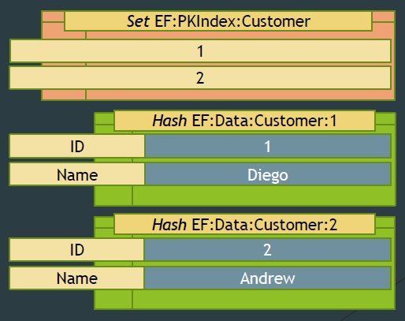
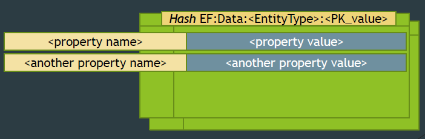

# EF Design Meeting Notes - July 17, 2014

## EF7 Redis provider

These are initial thoughts for the EF7 Redis provider. It is important to point out that at least initially EF7 will be limited to using a Redis store containing data structured in the very specific way that EF expects. The intention is to follow best practices in the way the data is structured. We are very interested in feedback on places where the proposed structure is not good. We are also interested in hearing about different structures that people use.

### Background: Redis concepts

* Databases: no names, simply a number. Each server can configure how many databases, n, it has and they are numbered 0 to n-1. Can only query from one DB at a time i.e. no cross-database queries. (Default n = 16).
* Keys: everything has a key in Redis, max key size is 512Mb but advice is to choose something short but readable i.e. “not too short, not too long”.
* Look up of any individual key is (very) fast, but scanning over all of them is slow. So it is recommended to partition your keys in some way. There is a convention of using “:” to separate parts of keys. But this is just a convention.

### Background: Data structures in Redis
(see http://redis.io/topics/data-types-intro)

* Simple key-value store (sometimes called String or Scalar storage). 
 * Key is a string, value is byte[]. 
 * Max length = 512Mb, but use “reasonable” key length. Helps to be readable. 
 * The keys which identify the other data types also share this space.
* Hashes: contain key-value (string -&gt; byte[]) pairs, non-repeating keys. Up to 232-1 pairs. Entry of a duplicate key simply overwrites the entry.
* Sets: contain a non-repeating set of strings. Up to 232-1 strings.
* Sorted Sets: sorted set of non-repeating strings, ordered by a “score” (and then by string if the scores are the same). Score is a float. Insert is O(log N) but can do relatively quick range queries on either the strings or the score. Up to 232-1 string-score pairs.
* Lists: double-ended list of strings. Up to 232-1 strings. Can contain dupes. Can push or pop to either end and so use as stack or queue as well.

### Example of Redis EF provider data structures

Suppose we had 2 Customers one with ID = 1, Name = Diego and another with ID = 2, Name = Andrew. We would store that as:
* A Set called EF:PKIndex:Customer with the values { 1, 2 }
* A Hash called EF:Data:Customer:1 with the values{ ID -&gt; “1”, Name -&gt; “Diego” }
* Another Hash called EF:Data:Customer:2 with the values{ ID -&gt; “2”, Name -&gt; “Andrew” }

### Redis EF provider data structures

One Redis set per entity type:

One Redis hash per entity instance:

### Insert for a given PK

Two operations are required for an insert. First an entry is inserted into the PK set.

Second create new hash called EF:Data:&lt;EntityType&gt;:&lt;PK_value&gt;. In that hash create mapping PropertyName -&gt; PropertyValue for every property.

We discussed whether or not to check and/or throw if an entry with the given PK already exists in the set. We decided that we should not do additional work to check, but using the information returned from the operation we can determine if an insert was made or not. This should be logged, and maybe we could provide an option to throw.

### Delete for a given PK

Delete entire hash called EF:Data:&lt;EntityType&gt;:&lt;PK_value&gt;:

From set EF:PKIndex:&lt;EntityType&gt; delete the &lt;PK_value&gt; key:

### Update properties for a given PK

In hash called EF:Data:&lt;EntityType&gt;:&lt;PK_value&gt; update the entries with key PropertyName to have new value ProperyValue. As with other EF providers, only properties marked as modified in the state manager will be updated.

### Query: Filtering (i.e. a WHERE clause)

1. If WHERE clause specifies only primary key just use EF:PKIndex:&lt;EntityType&gt; to find &lt;PK_value&gt;s that satisfy the WHERE clause.
2. Otherwise have to do table scan i.e. use EF:PKIndex:&lt;EntityType&gt; to give complete list of PKs for table. Then loop over that list getting the data back for each &lt;PK_value&gt;. Look through the data to see if it satisfies the WHERE clause.

It is important that we make it possible/easy to add additional indexes or other structures to avoid the scan for case 2. We also need to make sure that doing 2 without an additional index is logged as a warning. We should also look into more than just logging a warning to help people get appropriate perf for the queries they like. Ultimately it would be great to dynamically and transparently create appropriate indexes.

### Query: Projection

You have individual access to each Property in the EF:Data hash. This means setting up a call to all values or only the values wanted should be relatively easy.

### Query: Joining

In general Redis does not support joins. For now joins in EF7 for all providers are being done using client evaluation anyway; this will also be the case for Redis.

### Query: Sorting

* The SORT command allows you to sort a given list, set or sorted set:
 * SORT key BY pattern GET pattern [GET pattern …]
* But note the BY pattern and the GET pattern(s) can refer to field(s) of Hashes and can pass in the thing you are sorting on using the ‘*’ syntax. So for instance to get all values of the column Name for EntityType Customer with ID 1234 sorted by Age we would do:SORT EF:PKIndex:Customer BY EF:Data:11234: *-&gt; Age GET EF:Data:11234: *-&gt; Name
* You can also use the same command to store the result in another data structure that a LUA script could then analyze.

### Problems/Notes

* Redis is single-threaded. So only 1 command runs at a time.
* Transactions: To make multiple commands transactional use the MULTI/EXEC/DISCARD/WATCH/UNWATCH commands.
* Storing NULL. Redis does have binary-safe strings – so perhaps could store “\0”? Then would need to translate to/from “\0” wherever necessary. Or could use “absence of hash-key-value-pair” to indicate null. After discussion we decided to go with the latter--that is, if a property value is null, then no key-value pair will be saved for that property.
* Key separators (‘:’) – could use binary-safe string (e.g. ‘\t’ and ‘\t\t’ but that might make it hard to debug?) After discussion we decided to use ':' with escaping/quoting where necessary for string keys that contain ":"

### Key generation

It is simple to have an incremental key generator. Just set up a key with whatever the last key was. Key Generator then looks up the value, increments it, stores the value back and returns the new value i.e. just use the INCR command.

## Model validation

How eagerly and aggressively should EF7 be in validating the model? In previous versions of EF, model validation was part of view generation and was always performed on the full model before it could be used. This has the advantage that potential errors are reported early. It has the disadvantage that it can be very slow, and for a production app with a valid static model there is no point in validating it every time it is built or used.

In EF7 the model has significant characteristics such that:
* We want to be able to load the model incrementally, especially when using a compiled model. Loading the entire model to do validation would defeat this. However, we will have the entire model when building it, so validation could be done then.
* We are much less restrictive about what makes a valid model, partly because we support more different kinds of providers, and partly because if you don't need something to be in your model for the way you use it, then we don't want to aggressively tell you that you do need. For example, you should be able to query for any shape of "entity" even if it doesn't have a primary key as long as you don't attempt to track the results, do identity resolution, etc.

Given all this we decided to not do up-front validation in EF7, at least initially. We will instead validate lazily based on how you use the model. We will consider some form of up-front validation if feedback, bug reports, etc. indicate that it will significantly help people fall into a pit of success.

## Provider-specific conventions

We have been debating whether the model built by convention should be different depending on the provider that is being targeted. For example, given the same C# domain model, should the underlying EF IModel (in legacy terms, the c-space model) be the same when using Azure Table Storage (ATS) as it is when using SQL Server?

On the one hand it would be good for dealing with the model (e.g. in Migrations) if the model is always the same. It also makes it easier to switch between providers without changing the model.

On the other hand it seems likely that this level of abstraction is too great and we will end up with compromised models if abstracted this much. Two concrete examples from ATS:
* ATS supports ETag concurrency. This can be manually avoided, but by default it is used. If the entity POCO does not have an ETag property, then we could introduce one into shadow state. This seems to be most desirable behavior, but requires the model to be built differently for ATS than it is when using other providers.
* ATS requires a row key and partition key. The moral equivalent of a simple Identity key will not work. This means that a convention that makes an "Id" property the single primary key by convention is inappropriate for ATS, while still being good for most relational stores.

Given this we think that providers must be able to influence the by-convention model building.
